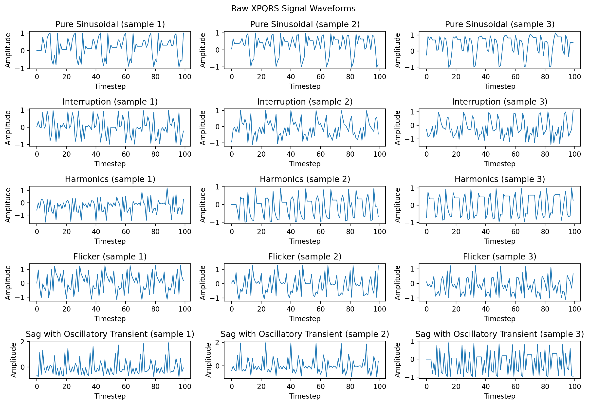
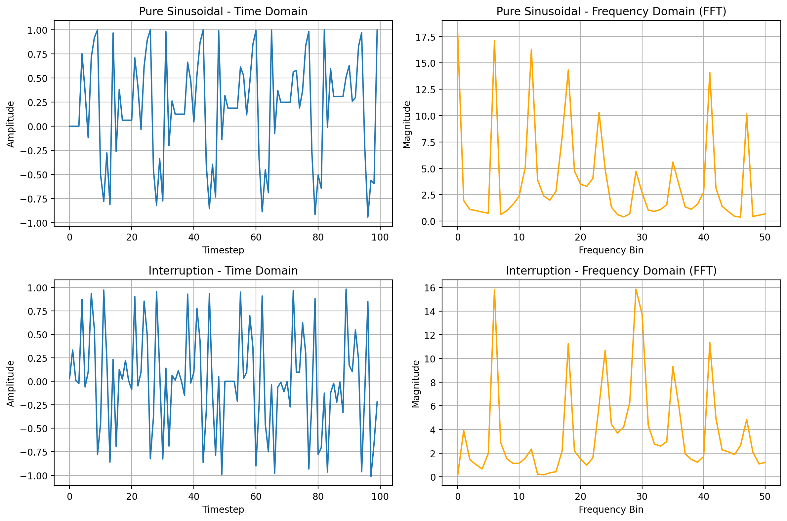
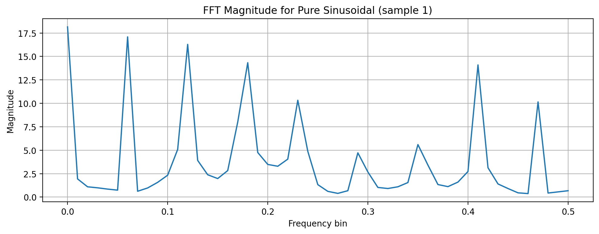
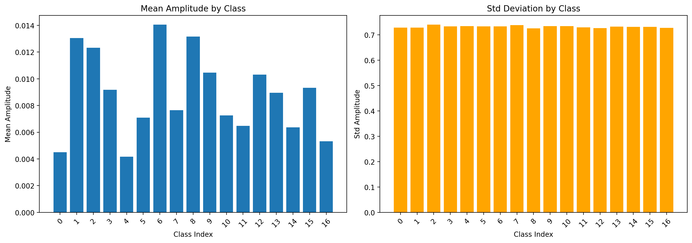
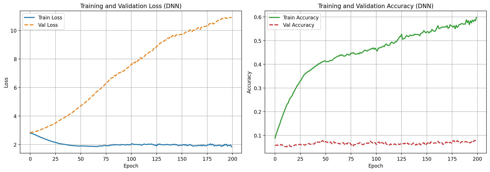
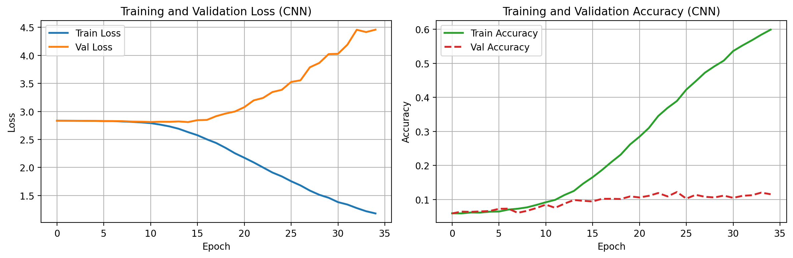
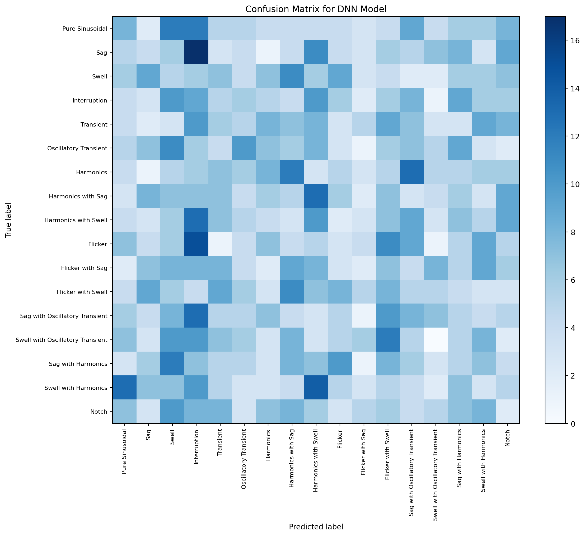
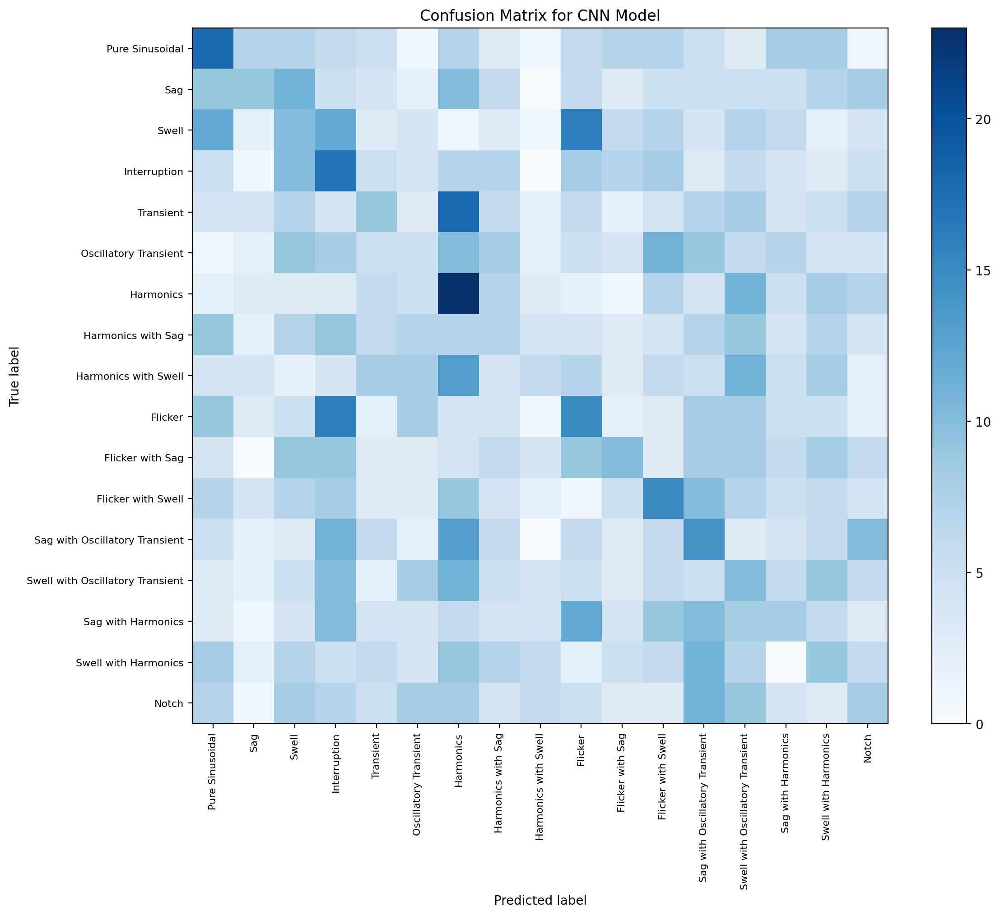

# LAPORAN TUGAS BESAR
## Klasifikasi Gangguan Sinyal Sistem Tenaga Listrik dengan Deep Neural Network

**Mata Kuliah:** Kecerdasan Buatan  
**Topik:** Klasifikasi 17 Jenis Gangguan Sinyal Listrik (Dataset XPQRS)  
**Arsitektur:** MLP (Multi-Layer Perceptron) + CNN 1D + Baseline Random Forest  
**Framework:** Python, scikit-learn, PyTorch  
**Tanggal:** Juni 2026

---

# BAB 1 — PENDAHULUAN

## 1.1 Latar Belakang

Sistem tenaga listrik modern bergantung pada kualitas sinyal tegangan dan arus yang stabil. Gangguan seperti *sag* (penurunan tegangan sementara), *swell* (kenaikan tegangan), harmonisa, *flicker*, dan transien dapat merusak peralatan elektronik, mengganggu proses industri, serta menimbulkan kerugian ekonomi. Deteksi dini dan klasifikasi otomatis jenis gangguan menjadi kebutuhan penting di bidang energi dan listrik.

Kemajuan *deep learning* memungkinkan mesin mempelajari pola dari sinyal time-series secara otomatis. Dataset **XPQRS** menyediakan 17.000 sampel sinyal simulasi dengan 17 kelas gangguan berbeda, sehingga cocok sebagai studi kasus klasifikasi multi-kelas pada domain energi & listrik menggunakan arsitektur **MLP** dan **CNN 1D**.

## 1.2 Rumusan Masalah

1. Bagaimana merancang pipeline *deep learning* end-to-end untuk mengklasifikasikan 17 jenis gangguan sinyal listrik?
2. Preprocessing apa yang tepat untuk data sinyal time-series agar model DNN dapat belajar dengan benar tanpa *data leakage*?
3. Bagaimana perbandingan performa antara MLP, CNN 1D, dan model baseline (Random Forest) pada masalah yang sama?
4. Apa yang dipelajari model secara internal, dan bagaimana menginterpretasikan hasil evaluasi serta keterbatasannya?

## 1.3 Tujuan

1. Membangun pipeline lengkap: pemuatan data → preprocessing → pelatihan → evaluasi → visualisasi.
2. Menerapkan dan menjelaskan preprocessing yang tepat beserta justifikasinya.
3. Membangun serta menganalisis arsitektur MLP dan CNN 1D untuk klasifikasi sinyal.
4. Menjelaskan setiap komponen teknis: layer, fungsi aktivasi, fungsi loss, *batch size*, dan strategi evaluasi.
5. Memvisualisasikan perilaku model (kurva *loss*, *confusion matrix*, statistik sinyal).

## 1.4 Batasan

| Aspek | Batasan |
|-------|---------|
| Dataset | XPQRS (`5Kfs_1Cycle_50f_1000Sam_1A.mat` + 17 file CSV) |
| Kelas | 17 kelas gangguan, masing-masing 1.000 sampel |
| Arsitektur DNN | MLP (scikit-learn) dan CNN 1D (PyTorch); CNN 2D tidak digunakan karena data bukan citra |
| Framework | Python 3, scikit-learn, PyTorch, NumPy, SciPy, matplotlib |
| Evaluasi | *Train/validation/test* split 80/10/10; K-Fold tidak dijalankan karena dataset besar (17.000 sampel) |
| Presentasi | Di luar cakupan dokumen ini (direkam terpisah untuk YouTube) |

---

# BAB 2 — TINJAUAN DATASET

## 2.1 Sumber dan Lisensi

Dataset **XPQRS** disimpan di folder `archive/XPQRS/`. File utama:

- **MATLAB:** `5Kfs_1Cycle_50f_1000Sam_1A.mat` — matriks 3D `(1000, 100, 17)`
- **CSV:** 17 file, satu per kelas, masing-masing berisi 1.000 baris × 100 kolom (satu baris = satu sinyal)

Metadata dari `Details.txt`:

| Parameter | Nilai |
|-----------|-------|
| Frekuensi fundamental | 50 Hz |
| Sampling rate | 5 kHz |
| Panjang sinyal | 100 sampel (20 ms) |
| Amplitudo | −1 hingga 1 (terskala) |
| Total sampel | 17.000 |
| Kelas | 17 (seimbang) |

## 2.2 Daftar Kelas Gangguan

| No | Kelas | No | Kelas |
|----|-------|----|-------|
| 1 | Pure Sinusoidal | 10 | Flicker |
| 2 | Sag | 11 | Flicker with Sag |
| 3 | Swell | 12 | Flicker with Swell |
| 4 | Interruption | 13 | Sag with Oscillatory Transient |
| 5 | Transient | 14 | Swell with Oscillatory Transient |
| 6 | Oscillatory Transient | 15 | Sag with Harmonics |
| 7 | Harmonics | 16 | Swell with Harmonics |
| 8 | Harmonics with Sag | 17 | Notch |
| 9 | Harmonics with Swell | | |

## 2.3 Deskripsi Fitur

| Fitur | Tipe | Satuan | Rentang | Keterangan |
|-------|------|--------|---------|------------|
| `t_0` … `t_99` | Numerik kontinu | amplitudo ternormalisasi | ≈ [−1.9, 1.9] | 100 *timestep* per sinyal |
| `label` | Kategorikal | — | 17 kelas | Di-*encode* dengan `LabelEncoder` |

**Fitur terstruktur (untuk Random Forest / MLP engineered):**

| Fitur | Deskripsi |
|-------|-----------|
| mean, std, min, max | Statistik domain waktu |
| median, ptp (range) | Pusat dan rentang amplitudo |
| rms, zero_crossings, mean_abs_dev | Energi dan karakteristik osilasi |
| 20 bin FFT (log) | Komponen domain frekuensi |

## 2.4 Statistik Deskriptif dan Visualisasi

Dataset seimbang: setiap kelas memiliki tepat 1.000 sampel. Tidak ditemukan *missing values* numerik pada file `.mat` maupun CSV. Sinyal yang tidak valid (baris kosong) diabaikan saat parsing.

**Gambar 2.1 — Contoh bentuk gelombang beberapa kelas**



**Gambar 2.2 — Perbandingan domain waktu dan frekuensi**



**Gambar 2.3 — Spektrum FFT kelas Pure Sinusoidal**



**Gambar 2.4 — Statistik amplitudo per kelas**



## 2.5 Tantangan Dataset

1. **Kemiripan antar kelas:** Kombinasi gangguan (misalnya *Sag with Harmonics* vs *Harmonics with Sag*) memiliki pola yang mirip.
2. **Durasi pendek:** Hanya 100 *timestep* (20 ms) — informasi temporal terbatas.
3. **17 kelas multi-kelas:** *Random guess* baseline ≈ 5,9% akurasi.
4. **Tidak ada imbalance:** Tidak diperlukan oversampling atau *class weights*.

---

# BAB 3 — METODOLOGI

## 3.1 Alur Kerja (Pipeline)

```
Input Data (.mat / .csv)
    ↓
EDA & Validasi Struktur
    ↓
Stratified Train / Val / Test Split (80/10/10)
    ↓
Preprocessing (StandardScaler — fit hanya pada train)
    ↓
┌─────────────────┬──────────────────┬─────────────────┐
│ Random Forest   │ MLP (raw / feat) │ CNN 1D (raw)    │
│ (fitur tabular) │ scikit-learn     │ PyTorch         │
└─────────────────┴──────────────────┴─────────────────┘
    ↓
Evaluasi (Accuracy, Precision, Recall, F1, Confusion Matrix)
    ↓
Visualisasi (kurva loss, confusion matrix, statistik sinyal)
    ↓
Pembahasan & Kesimpulan
```

## 3.2 Preprocessing

### 3.2.1 Missing Values

- **Temuan:** Tidak ada nilai hilang pada variabel `Out` di file `.mat`.
- **Penanganan:** Record CSV yang gagal diparse di-*drop* (`ensure_float_sequence` mengembalikan list kosong → `continue`).
- **Justifikasi:** Untuk sinyal time-series, imputasi dapat merusak pola temporal. Karena jumlah data besar, strategi *drop* aman.

### 3.2.2 Normalisasi / Standardisasi

Digunakan **`StandardScaler`** (μ=0, σ=1):

```python
scaler = StandardScaler()
X_train = scaler.fit_transform(X_train)   # fit HANYA pada train
X_val   = scaler.transform(X_val)
X_test  = scaler.transform(X_test)
```

- **Alasan:** Model berbasis gradien (MLP, CNN) sensitif terhadap skala input.
- **Risiko tanpa normalisasi:** Konvergensi lambat, gradien tidak stabil, satu fitur mendominasi.
- **Anti data leakage:** Scaler tidak pernah di-*fit* pada val/test atau keseluruhan dataset sebelum split.

### 3.2.3 Encoding Fitur Kategorikal

- **Target:** 17 kelas → `LabelEncoder` (integer 0–16).
- **Alasan:** `CrossEntropyLoss` (PyTorch) dan `MLPClassifier` (sklearn) menerima label integer.
- **Perbedaan One-Hot vs Label Encoding:**
  - *Label encoding:* ringkas, cocok untuk kelas mutually exclusive.
  - *One-hot:* vektor panjang K, digunakan jika loss mengharapkan probabilitas per kelas eksplisit.

### 3.2.4 Reshape untuk CNN 1D

```python
# Input awal: (n_samples, 100)
X_tensor = torch.from_numpy(X_train).unsqueeze(1).float()
# Shape akhir: (n_samples, 1, 100)  → (batch, channels, length)
```

PyTorch `Conv1d` mengharapkan input `(batch, channels, length)`. Channel tunggal = satu sinyal univariat.

### 3.2.5 CNN 2D

Tidak diterapkan — data bukan citra 2D. Jika diadaptasi ke citra, diperlukan resize, normalisasi pixel [0,1], dan opsi grayscale.

### 3.2.6 Keseimbangan Kelas

Dataset **balanced** (1.000/kelas). Split menggunakan `stratify=y` agar proporsi kelas terjaga di train, val, dan test.

## 3.3 Strategi Pemisahan Data

| Set | Proporsi | Jumlah Sampel | Peran |
|-----|----------|---------------|-------|
| Training | 80% | 13.600 | Update bobot model |
| Validation (Dev) | 10% | 1.700 | Tuning, early stopping, pemilihan epoch terbaik |
| Test | 10% | 1.700 | Evaluasi final — tidak disentuh selama eksperimen |

**Justifikasi rasio 80/10/10:** Dengan 17.000 sampel, data train cukup besar untuk belajar, sementara val/test masing-masing 1.700 sampel (~100 per kelas) memadai untuk estimasi performa per kelas.

**Stratified split:** Wajib dipertahankan meskipun dataset seimbang, agar setiap fold/set memiliki 100 sampel per kelas.

**Cross-validation:** Tidak digunakan karena dataset > 1.000 sampel. Single split sudah representatif. K-Fold lebih cocok untuk dataset < 500 sampel.

**Peringatan dev set:** Dev set digunakan berulang (early stopping, pemilihan hyperparameter), sehingga informasinya "bocor" ke proses desain model. Test set tetap diperlukan untuk laporan performa yang jujur.

## 3.4 Arsitektur Model

### 3.4.1 Baseline: Random Forest

```python
RandomForestClassifier(n_estimators=100, random_state=42)
```

- **Input:** 9 fitur statistik per sinyal (dari pipeline CSV, 17.000 sampel).
- **Peran:** Baseline interpretable untuk membandingkan dengan DNN.

### 3.4.2 MLP (Multi-Layer Perceptron)

```
Input (100 fitur raw ATAU 28 fitur engineered)
  → Dense 256 + ReLU
  → Dense 128 + ReLU
  → Dense 64  + ReLU
  → Dense 17  + Softmax (internal sklearn)
```

**Penjelasan layer Dense:**

Operasi: \( y = \phi(W \cdot x + b) \)

- \(W\): matriks bobot, \(x\): vektor input, \(b\): bias, \(\phi\): ReLU.
- **256 → 128 → 64:** Piramida menurun — layer awal menangkap kombinasi fitur kompleks, layer akhir memadatkan representasi.
- Terlalu sedikit neuron → *underfitting*; terlalu banyak → *overfitting* dan biaya komputasi tinggi.

**Aktivasi output:** Softmax (multi-kelas, mutually exclusive).  
**Loss:** *Cross-entropy* / log-loss (pasangan softmax + CE secara matematis konsisten).

### 3.4.3 CNN 1D

```
Input: (batch, 1, 100)
  → Conv1d(1→32, k=3, pad=1) + ReLU + MaxPool(2)   # length: 100→50
  → Conv1d(32→64, k=3, pad=1) + ReLU + MaxPool(2)  # length: 50→25
  → Conv1d(64→128, k=3, pad=1) + ReLU + MaxPool(2) # length: 25→12
  → Flatten → Linear(1536→256) + ReLU + Dropout(0.5)
  → Linear(256→128) + ReLU + Dropout(0.5)
  → Linear(128→17)  [logits, tanpa softmax eksplisit]
```

**Conv1D:** Filter melakukan konvolusi *sliding window* — \( y[t] = \sum_i w_i \cdot x[t+i] + b \). Efektif untuk pola lokal berulang pada time-series.

**MaxPooling:** Mereduksi dimensi temporal, mempertahankan fitur dominan, menekan noise.

**Flatten vs GlobalAveragePooling:** Proyek ini memakai **Flatten** karena panjang sinyal pendek (100) dan arsitektur sudah kecil. GAP lebih baik untuk feature map besar agar mengurangi parameter.

**Aktivasi output:** Linear (logits) — `CrossEntropyLoss` PyTorch sudah mengaplikasikan *log-softmax* internal.  
**Loss:** `nn.CrossEntropyLoss()` = *sparse categorical cross-entropy*.

### 3.4.4 Konsekuensi Aktivasi/Loss Salah

| Kombinasi Salah | Dampak |
|-----------------|--------|
| Sigmoid + regresi | Output terbatas (0,1), tidak bisa prediksi nilai di luar rentang |
| Linear + klasifikasi tanpa loss logits | Gradien tidak sesuai, optimasi gagal |
| MSE untuk klasifikasi | Landscape loss tidak convex untuk label diskrit, konvergensi buruk |
| BCE untuk regresi | Mengasumsikan distribusi Bernoulli, bukan nilai kontinu |

## 3.5 Konfigurasi Training

| Parameter | MLP | CNN 1D |
|-----------|-----|--------|
| Optimizer | Adam (`solver='adam'`) | Adam (lr=1e-3) |
| Learning rate | Default sklearn (~1e-3) | 0.001 |
| Batch size | 128 | 128 |
| Epoch | 200 (warm_start manual) | 50 (early stopping patience=10) |
| Regularisasi | L2 (`alpha=1e-4`) | Dropout 0.5 |
| Early stopping | Tidak (MLP script) | Ya — epoch terbaik: 25 |

**Batch size 128 (mini-batch):** Kompromi antara stabilitas gradien dan efisiensi memori. Batch lebih kecil → noise gradien lebih besar (bisa membantu generalisasi); batch lebih besar → konvergensi lebih stabil tapi butuh memori lebih.

**Linear Scaling Rule:** Jika batch size dinaikkan 2×, learning rate idealnya juga dinaikkan ~2× agar estimasi gradien konsisten. Perlu validasi empiris.

---

# BAB 4 — HASIL DAN ANALISIS

## 4.1 Kurva Training

**Gambar 4.1 — Kurva loss dan akurasi MLP (DNN)**



**Analisis MLP:**
- *Train loss* menurun, namun *val loss* meningkat setelah beberapa epoch → indikasi **overfitting**.
- *Val accuracy* stagnan di sekitar 5–7% (hampir random untuk 17 kelas).
- Model belum mempelajari diskriminasi antar kelas secara efektif pada input raw.

**Gambar 4.2 — Kurva loss dan akurasi CNN 1D**



**Analisis CNN:**
- Performa val sedikit lebih baik dari MLP (~12% vs ~7%).
- *Val loss* melonjak di akhir training → overfitting setelah epoch ~25.
- Early stopping di epoch 25 merupakan keputusan yang tepat.

## 4.2 Visualisasi Internal Model

Visualisasi statistik sinyal (Gambar 2.1–2.4) menunjukkan bahwa kelas-kelas memiliki profil amplitudo dan frekuensi yang berbeda, namun beberapa kelas kombinasi (misalnya varian *Sag*/*Swell* dengan harmonisa) saling tumpang tindih — menjelaskan kesulitan klasifikasi DNN.

*Confusion matrix* pada Gambar 4.3–4.4 memperlihatkan prediksi tersebar di banyak kelas (tidak terkonsentrasi pada diagonal), mengkonfirmasi bahwa model DNN belum mempelajari batas keputusan yang tajam.

## 4.3 Evaluasi pada Test Set

### Tabel 4.1 — Ringkasan Performa Semua Model

| Model | Input | Val Accuracy | Test Accuracy | Keterangan |
|-------|-------|:------------:|:-------------:|------------|
| Random Forest | 9 fitur statistik | — | **83,76%** | Baseline terbaik |
| MLP | Raw signal (100) | 7,29% | 5,65% | Underfitting / sulit belajar |
| CNN 1D | Raw signal (100) | 12,18% | 10,88% | Sedikit di atas random |
| Random guess | — | — | ~5,88% | 1/17 |

### Random Forest — Classification Report (Test, ringkasan)

- **Accuracy:** 83,76%
- **Macro F1:** 0,84
- Kelas terkuat: Pure Sinusoidal, Harmonics, Flicker (F1 ≈ 0,99)
- Kelas terlemah: Flicker with Swell, Harmonics with Swell, Swell with Harmonics (F1 ≈ 0,59–0,63)

### MLP — Test Accuracy: 5,65%

Performa mendekati tebakan acak. Confusion matrix menunjukkan prediksi hampir merata ke semua kelas.

### CNN 1D — Test Accuracy: 10,88%

Sedikit lebih baik dari MLP karena kemampuan menangkap pola lokal temporal, namun masih jauh di bawah Random Forest.

**Gambar 4.3 — Confusion Matrix MLP**



**Gambar 4.4 — Confusion Matrix CNN 1D**



## 4.4 Tabel Eksperimen

| Eksperimen | Arsitektur | Input | LR | Batch | Dropout | Val Acc | Test Acc | Catatan |
|------------|-----------|-------|-----|-------|---------|---------|----------|---------|
| Baseline-01 | Random Forest | 9 fitur statistik | — | — | — | — | 83,76% | Baseline kuat |
| Exp-02 | MLP 3-layer | Raw 100 | ~1e-3 | 128 | L2 1e-4 | 7,29% | 5,65% | Underperform |
| Exp-03 | CNN 1D | Raw 100 | 1e-3 | 128 | 0,5 | 12,18% | 10,88% | Early stop ep. 25 |
| Exp-04 | MLP + engineered | 28 fitur FFT | ~1e-3 | 128 | L2 1e-4 | [future] | [future] | Direkomendasikan |

---

# BAB 5 — PEMBAHASAN

## 5.1 Kesesuaian Arsitektur dengan Masalah

**CNN 1D** secara teori paling sesuai untuk sinyal time-series karena:
- *Weight sharing* pada filter konvolusi — parameter lebih efisien.
- Invariansi translasi — pola serupa terdeteksi di posisi berbeda.
- Pembelajaran hierarkis fitur lokal → global.

**MLP** pada raw signal kurang efektif karena:
- Setiap *timestep* diperlakukan sebagai fitur independen tanpa eksploitasi struktur temporal eksplisit.
- 100 input langsung ke dense layer → banyak parameter, risiko overfitting tinggi pada pola kompleks.

**Random Forest** unggul karena fitur statistik (mean, std, FFT) sudah merangkum karakteristik domain yang relevan secara eksplisit.

## 5.2 Analisis Kurva Training

| Gejala | Model | Interpretasi | Solusi |
|--------|-------|--------------|--------|
| Val loss naik, train loss turun | MLP, CNN | Overfitting | Dropout lebih tinggi, lebih sedikit epoch, augmentasi |
| Val acc ≈ random | MLP | Underfitting / fitur tidak informatif | Feature engineering, arsitektur lebih dalam |
| Early stop ep. 25 | CNN | Model terbaik sebelum overfitting | Sudah ditangani dengan benar |

## 5.3 Interpretasi Visualisasi

- **Waveforms:** Kelas murni (Pure Sinusoidal) memiliki pola periodik reguler; kelas gangguan menunjukkan distorsi amplitudo/fase.
- **FFT:** Memisahkan komponen frekuensi — berguna untuk harmonisa vs transien.
- **Confusion matrix DNN/CNN:** Kesalahan tersebar luas → model belum mempelajari fitur diskriminatif yang kuat.

## 5.4 Faktor Paling Berpengaruh

1. **Representasi input** — fitur engineered >> raw signal untuk klasik ML.
2. **Kompleksitas kelas** — 17 kelas dengan variasi kombinasi gangguan sangat menantang.
3. **Durasi sinyal pendek** — 20 ms mungkin tidak cukup untuk membedakan semua jenis gangguan.
4. **Kapasitas vs regularisasi** — MLP/CNN perlu tuning lebih lanjut.

## 5.5 Keterbatasan dan Perbaikan

| Keterbatasan | Perbaikan yang Disarankan |
|--------------|---------------------------|
| DNN akurasi rendah | Gunakan MLP dengan 28 fitur engineered; tuning LR dan arsitektur |
| Tidak ada augmentasi | Jitter, scaling, time-shift pada sinyal training |
| Tidak ada K-Fold | Opsional untuk validasi robustness |
| Visualisasi internal terbatas | Tambah plot bobot filter Conv1D dan distribusi aktivasi |
| Tidak ada Grad-CAM | Implementasi saliency map 1D untuk interpretabilitas |

---

# BAB 6 — KESIMPULAN DAN SARAN

## 6.1 Kesimpulan

1. Pipeline *deep learning* end-to-end berhasil dibangun untuk klasifikasi 17 gangguan sinyal listrik dataset XPQRS.
2. Preprocessing dengan `StandardScaler` setelah split (80/10/10 stratified) diterapkan dengan benar tanpa *data leakage*.
3. **Random Forest** dengan fitur statistik mencapai **83,76%** akurasi test — baseline terkuat.
4. **MLP** (5,65%) dan **CNN 1D** (10,88%) pada raw signal belum mengungguli baseline, namun CNN sedikit lebih baik karena struktur konvolusi untuk time-series.
5. Visualisasi (waveform, FFT, kurva training, confusion matrix) membantu memahami perilaku data dan model — sesuai tujuan pembelajaran panduan tugas besar.
6. Hasil yang kurang optimal pada DNN **dapat dijelaskan secara teknis** (fitur input, overfitting, kemiripan kelas) — selaras dengan penekanan panduan bahwa pemahaman konsep lebih penting dari angka akurasi semata.

## 6.2 Jawaban Rumusan Masalah

| Rumusan | Jawaban Singkat |
|---------|-----------------|
| Pipeline DNN end-to-end? | Ya — `src/load_data` hingga `src/visualize` |
| Preprocessing tepat? | StandardScaler + LabelEncoder + reshape (1,100) untuk CNN |
| Perbandingan model? | RF >> CNN 1D > MLP >> random |
| Interpretasi internal? | Kurva loss, confusion matrix, visualisasi sinyal tersedia |

## 6.3 Saran Pengembangan

1. Latih MLP dengan **28 fitur engineered** (time + FFT) sebagai eksperimen utama DNN.
2. Tambahkan **data augmentation** pada sinyal training.
3. Eksplorasi arsitektur CNN lebih dalam (BatchNorm, kernel lebih besar, GAP).
4. Implementasikan **permutation importance** dan visualisasi bobot filter Conv1D.
5. Rekam **presentasi YouTube** yang menjelaskan setiap keputusan teknis dari notebook ini.

---

# LAMPIRAN

## A. Struktur Repositori

```
UAS_KECEBUT/
├── archive/XPQRS/          # Dataset
├── src/                    # Kode Python
├── models/                 # Model terlatih (.pkl)
├── results/                # Laporan training & split data
├── visualizations/         # Gambar hasil visualisasi
├── LAPORAN_TUGAS_BESAR.md  # Laporan ini
├── Project_Documentation.ipynb
└── requirements.txt
```

## B. Perintah Menjalankan Pipeline

```powershell
python -m venv .venv
.\.venv\Scripts\activate
pip install -r requirements.txt

python -m src.load_data
python -m src.preprocess
python -m src.train_model
python -m src.train_dnn
python -m src.train_cnn --epochs 50 --batch-size 128
python -m src.visualize
```

## C. Konsep Wajib Panduan — Checklist

| Konsep | Bab | Status |
|--------|-----|--------|
| Preprocessing & missing values | 3.2 | ✓ |
| Normalisasi & data leakage | 3.2 | ✓ |
| Label encoding | 3.2 | ✓ |
| Reshape CNN 1D | 3.2.4 | ✓ |
| Penjelasan layer Dense/Conv/Pool | 3.4 | ✓ |
| Aktivasi output & loss | 3.4.4 | ✓ |
| Train/dev/test split | 3.3 | ✓ |
| Cross-validation (diskusi) | 3.3 | ✓ |
| Batch size | 3.5 | ✓ |
| Visualisasi loss & confusion matrix | 4.1–4.3 | ✓ |
| Visualisasi internal (statistik sinyal) | 4.2 | ✓ |

---

*Dokumen ini merupakan laporan tunggal tugas besar Kecerdasan Buatan. Semua gambar diambil dari folder `visualizations/` hasil menjalankan `python -m src.visualize`.*
